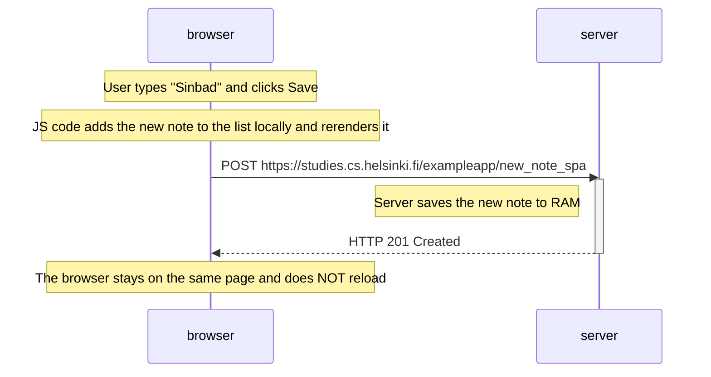

```mermaid
sequenceDiagram
    participant browser
    participant server

    Note over browser: User types "Sinbad" and clicks Save
    Note over browser: JS code adds the new note to the list locally and rerenders it

    browser->>server: POST https://studies.cs.helsinki.fi/exampleapp/new_note_spa
    activate server
    Note left of server: Server saves the new note to RAM
    server-->>browser: HTTP 201 Created
    deactivate server

    Note over browser: The browser stays on the same page and does NOT reload
```
